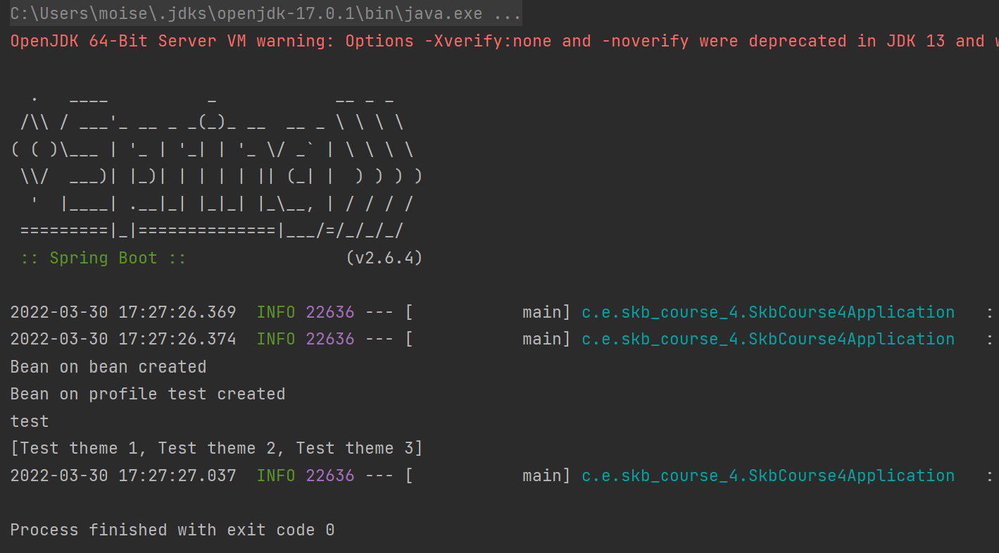

# Spring Boot configurations (hw 4)
## Файл конфигурации ```application.yml```
Созданы три разных конфигурации, для разных профилей.
```
spring:
  config:
    activate:
      on-profile: dev
name: skbCourse-dev
my:
  studentName: production
  color: red
  courseThemes:
  - Sample theme 1
  - Sample theme 2
  - Sample theme 3
  home: ${JAVA_HOME:default}
---
spring:
  config:
    activate:
      on-profile: test
name: skbCourse-test
my:
  studentName: production
  color: blue
  courseThemes:
  - Test theme 1
  - Test theme 2
  - Test theme 3
  home: ${JAVA_HOME:default}
---
spring:
  config:
    activate:
      on-profile: prod
name: skbCourse-prod
my:
  studentName: production
  courseThemes:
    - git
    - Spring boot hello
    - DI
  home: ${JAVA_HOME:default}
```
## Данные параметры подставляются в ```MyConfiguration```
```
@Component
@ConfigurationProperties(prefix = "my")
public class MyConfiguration {
    private List<String> courseThemes;
    private String studentName;

    public void setStudentName(String studentName) {
        this.studentName = studentName;
    }

    public void setCourseThemes(List<String> courseThemes) {
        this.courseThemes = courseThemes;
    }

    public List<String> getCourseThemes() {
        return courseThemes;
    }

    @PostConstruct
    void postConstruct() {

        System.out.println(studentName);
        System.out.println(courseThemes.toString());
    }
}
```
# Также были созданы три бина:
## ```BeanOnProfile```
Создается если профиль test
```
@Component
@Profile("test")
public class BeanOnProfile {

    @PostConstruct
    public void postConstruct() {
        System.out.println("Bean on profile test created");
    }
}
```
## ```BeanOnPreviousBean```
Создается если существует ```BeanOnProfile```
```
@Component
@ConditionalOnBean(BeanOnProfile.class)
public class BeanOnPreviousBean {

    @PostConstruct
    public void postConstruct() {
        System.out.println("Bean on bean created");
    }
}
```
## ```BeanIsValueNotDefault```
Создается если ```my.home != "default"```
```
@Component
@ConditionalOnExpression("'${my.home}' != 'default'")
public class BeanIsValueNotDefault {

    @PostConstruct
    public void postConstruct() {
        System.out.println("Bean on default value created");
    }
}
```
## Скриншот работы
